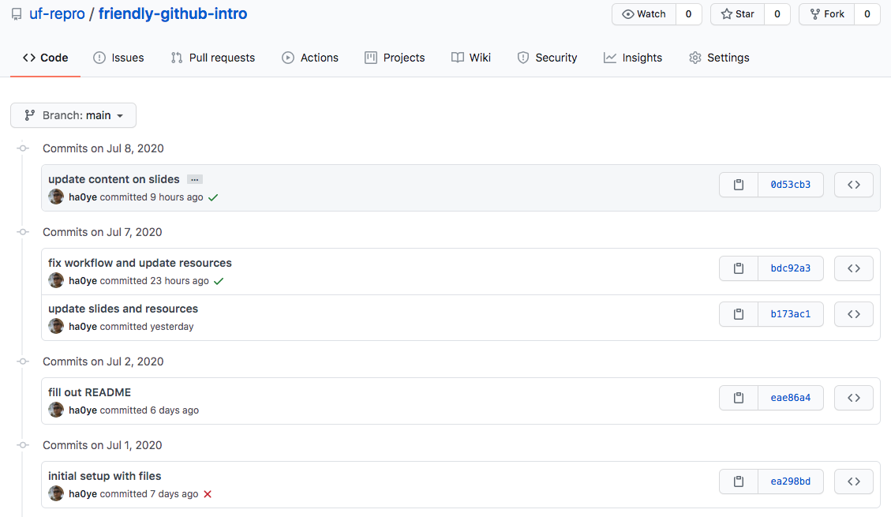
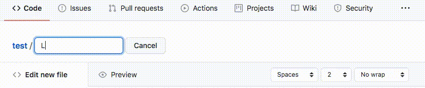
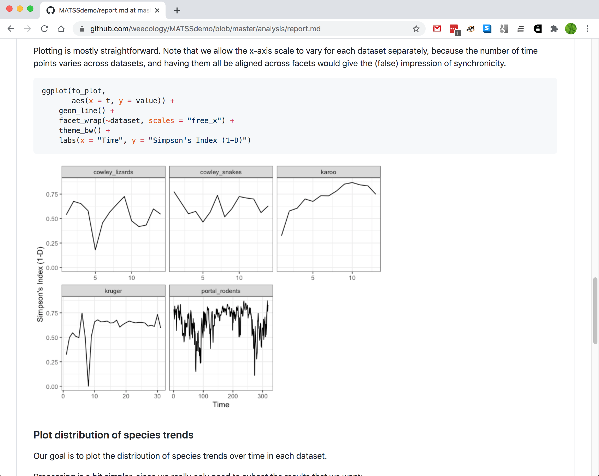

```{r setup, include=FALSE}
options(htmltools.dir.version = FALSE)
```

```{r xaringan-themer, include=FALSE, warning=FALSE}
library(xaringanthemer)
style_mono_accent(
  base_color = "#09274B",
  base_font_size = "32px", 
  header_h1_font_size = "2.0rem",
  header_h2_font_size = "1.5rem",
  header_h3_font_size = "1.25rem", 
  header_background_content_padding_top = "2rem", 
  header_font_google = google_font("Lato"),
  text_font_google   = google_font("Montserrat", "300", "300i", "500"),
  code_font_google   = google_font("Source Code Pro", "300", "500"), 
  extra_css = list("p" = list("margin-block-start" = "0.5em", 
                              "margin-block-end" = "0.5em"), 
                   "ul" = list("margin-block-start" = "0.5em", 
                              "margin-block-end" = "0.5em"), 
                   "li" = list("margin-block-start" = "0.5em", 
                              "margin-block-end" = "0.5em"), 
                   "pre" = list("margin-top" = "0.5em", 
                              "margin-bottom" = "0.5em"), 
                   ".caption" = list("display" = "none")), 
  link_color = "#339944"
)
```
class: inverse, center, middle

# `r desc::desc_get('Title', '..')`
### `r rmarkdown::metadata$author`
### `r rmarkdown::metadata$institute`
### (updated: `r Sys.Date()`)

---

# Motivations

Good practices *save time* in project management:
* revert back to previous versions
* interact with collaborators working on the same files
* share your work and have it cited

---

# Learning Outcomes

By the end of the workshop, participants will be able to:

`r gsub("\n ", "\n", desc::desc_get("learningOutcomes"))`

---

class: inverse, center, middle

# Version Control Concepts

---

# Version Control

Tools/systems to manage changes to files.

--
## You are probably already using version control!

* MS Word has "track changes"
* Dropbox / Google Drive can revert versions

---

# Why learn GitHub?

GitHub is version control for **projects**:

* changes that are not in MS Word files
* restore a specific project state, involving multiple files that have changed
* knowing *who* made changes and  *why*
* handle multiple collaborators working on the same files

---

# Example scenarios

* You change a histogram to a bar plot, and then you want to change it back.
* Your collaborator makes edits while traveling, and you need to combine their changes with changes you made in the meantime.
* You want to experiment with a different dataset / analysis / narrative without duplicating everything.

---

class: inverse, center, middle

# Git and GitHub
--

## (not the same thing!)

---

# Git

* software and version control system
* notoriously unfriendly
  - unintuitive command names
  - obscure error messages

--

**This workshop does NOT teach you to use Git directly!**
* check out the [resources page](https://uf-repro.github.io/friendly-github-intro/resources.html) for tutorials, guides, etc.

---

# Git Concepts

* Git tracks a project folder, and changes to all its contents
  - the folder is called a *repository* or *repo*
* Tracking changes occurs via taking a snapshot of repo:
  - each snapshot is called a *commit*

---

```{r, echo = FALSE, fig.cap = "A screenshot of the website https://github.com/uf-repro/friendly-github-intro/commits/main, showing the commit log for the repo of *this* lesson. Each commit entry has an associated date and time, the author, and the summary of the commit message."}

```

---

# Commit Contents

* each commit requires a *commit message*
  - 1-line summary
  - blank line
  - further details
* commits also record *who* and *when* (automatically)

---

```{r, echo = FALSE, fig.cap = "A screenshot of the website https://github.com/uf-repro/friendly-github-intro/commits/main, showing the commit log for the repo of *this* lesson. Each commit entry has an associated date and time, the author, and the summary of the commit message."}

```

---

# Creating Commits

* each commit is constructed *manually*
* `add` files that have changed (including new files)
  - Git tracks changes only, so only the changed files need to be noted
  - one common method is to add all the files in the repo 
* this method is annoying, but gives you precise control over what changes to record

---

# GitHub

* a cloud platform that hosts Git repos
* unlimited *public* and *private* repos
* size limits:
  - 1 GB for each repo
  - 100 MB for individual files
* [GitHub Education](https://education.github.com/pack) has some benefits
  - one code for a free t-shirt from https://github.myshopify.com/ to be given away to a random attendee
  

---

class: inverse, center, middle

# GitHub in a Web Browser

---

# Using GitHub

https://github.com
* create an account / log in
* create a new repo
* upload files
* write a commit message

---

class: center, middle

# DEMO

---

class: inverse, center, middle

# Using Git Clones

---

# Synchronizing Repos

* Git is designed to be decentralized--repos can exist in multiple locations:
  - *clone* = "make a copy of a Git repo"
  - *push* = "send new commits from here to somewhere else"
  - *pull* = "retrieve new commits from somewhere else to here"

---

# Working with Git clones

* you need the `Git` software
  - [instructions from Software Carpentry](https://carpentries.github.io/workshop-template/#git)
  - [guide to command-line usage](https://swcarpentry.github.io/git-novice/)  
    (too advanced for this workshop)

--

* [GitHub Desktop](https://desktop.github.com/)
  - graphical interface for Git
  - also syncs your computer with GitHub
  
---

class: center, middle

# DEMO

---

class: inverse, center, middle

# Best Practices for Git Repos

---

# Readme

* a `README.md` file in the top directory
  - what the project is about
  - who is working on it
  - who is it for
  - installation/usage instructions

---

# License

* a `LICENSE` file in the top directory
  - how other people can *use* your content
  - by default, in the US, you have full rights on creative works
* select based on content type:
  - MIT (permissive, code)
  - CC-BY (permissive, non-code)
  - CC0 (public-domain, data)
  
---

# Adding a license

* when creating a new repo, you have the option of choosing the template for an existing license

* on [github.com](https://github.com), adding a file named `LICENSE` brings up a button:

--

```{r, echo = FALSE, fig.cap = "An animation of adding a file named `LICENSE` in the github.com interface, and then being able to click on a `Choose a License` button"}

```

---

# Markdown

* GitHub will render some common file formats directly in the web browser:
  - images, plain text
* markdown is preferred for formatting text and images
  - uses plain text, but renders nicely
  - [a guide to syntax](https://github.com/adam-p/markdown-here/wiki/Markdown-Cheatsheet)

---

```{r, echo = FALSE, fig.cap = "A screenshot of the website https://github.com/weecology/MATSSdemo/blob/master/analysis/report.md, showing a markdown report with formatted text and embedded figures."}

```

---

# Thanks

* Let me know what content you'd like to see
* Contact me for additional questions or consultation requests!
* Check back in on the libguide for more modules and contact info:
  - https://guides.uflib.ufl.edu/reproducibility
